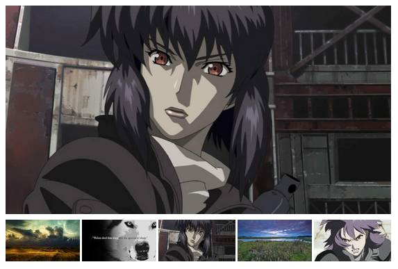

# Photo Gallery - Vue web component

Drop in page photo gallery web component made with Vue.

By default renders one random image and 5 thumbnails. The large image and random images are clickable, opening a [lightbox image viewer](https://github.com/am283721/vue-my-photos), allowing full-screen browsing of the images (including keyboard support).

## Usage

Collect a bunch of JPG/PNG images in a folder somewhere.

Run `./make_thumbs.sh <path to images>` to generate thumbnails.

Run `./make_manifest.py` to generate the manifest.

The processed images will be found in `images/`.

Upload the contents of `images` folder (including `_thumb` and `_medium` folders, and the `manifest.json` file inside) to a folder on your server served by the web server.

Upload the `dist/photo-gallery.js` script to the server in to a place where it can be reached from.

Include the component by loading the following on your site. Correct the path to `photo-gallery.js` as needed.

    
    

Add the component to your site HTML as follows:

    <photo-gallery images-path="/path/to/images/"></photo-gallery>
    
By default the component will look for images in `/images` so if you upload them there, no `images-path` needs to be set. Note, `images-path` can also refer to an URL, though your browser will most likely block CORS requests cross-domain.

### Configuration

**images-path**

Path or URL to the images folder which also includes the manifest and processsed medium and thumb sized files (see above). Defaults to `/images`.

Example: `<photo-gallery images-path="/path/to/images/"></photo-gallery>`

**hide-main-image**

By default a medium size large image will be shown. Pass "true" to hide the main image and just render thumbs.

Example: `<photo-gallery hide-main-image="true"></photo-gallery>`

**thumbs-count**

Controls how many thumbnails to render. Defaults to 5.

Example: `<photo-gallery thumbs-count="20"></photo-gallery>`

## Development

Install Node 10.

Run NPM install.

Do awesome changes.

Compile:

    node_modules/.bin/vue build -t wc PhotoGallery.vue

### Preview

In another shell, have `python3 -m http.server` running in the root of the project.

Collect some images in a folder, then run:

    ./make_thumbs.sh <path to source images>
    ./make_manifest.py

Compile the component.

Open a web browser at `http://localhost:8000/dist/demo.html`

## Licence

MIT

## Author

Jason Robinson / https://jasonrobinson.me / @jaywink:feneas.org
